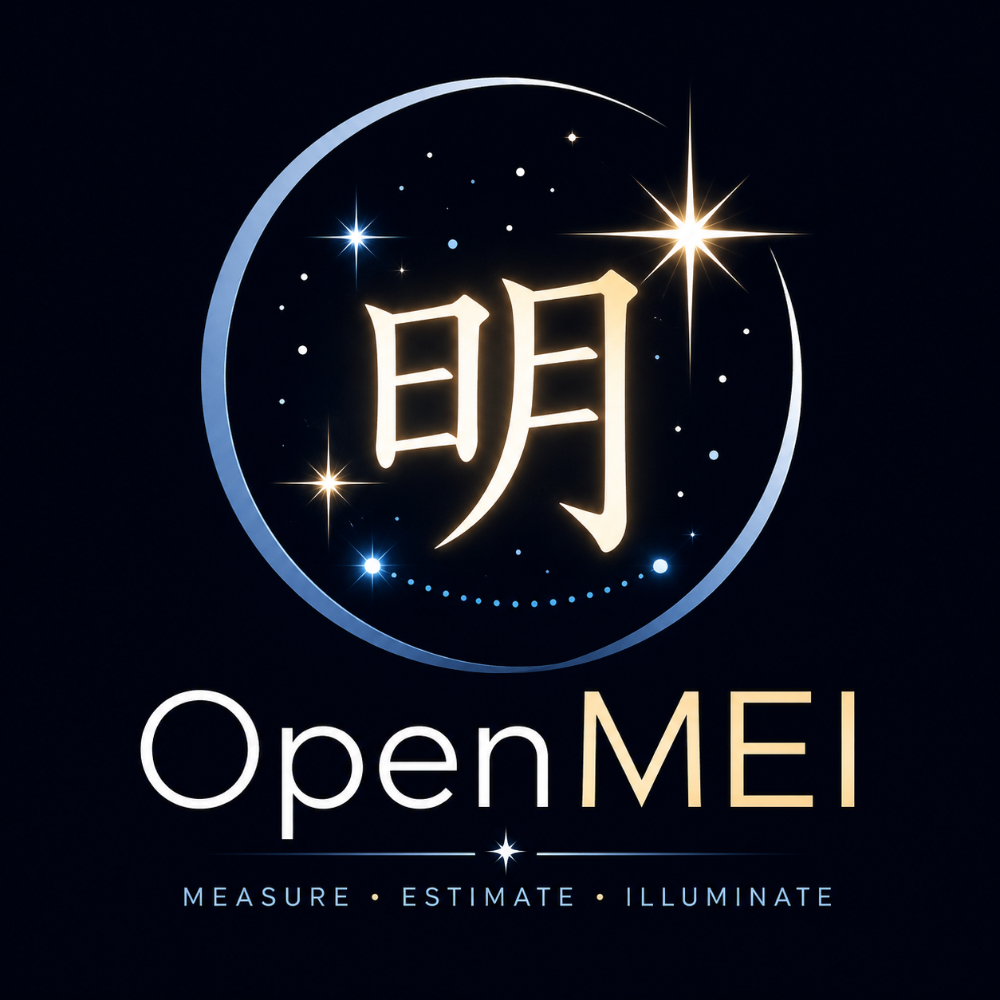

<p align="center">
  
</p>

# OpenMEI

**OpenMEI** is an open-source **Differential Image Motion Monitor (DIMM)** application for measuring astronomical seeing.

It acquires short-exposure images of a star through a two-aperture DIMM mask, measures the differential motion of the resulting stellar images, and converts the longitudinal and transverse image-motion variances into estimates of the Fried parameter $r_0$ and atmospheric seeing.

OpenMEI is intended both as a practical seeing monitor and as an instrument whose measurement chain can be inspected, calibrated, reproduced, and validated.

Current features include:

* Real-time camera acquisition and centroid tracking
* Longitudinal and transverse differential image-motion measurement
* Fried parameter $r_0$ estimation
* Seeing FWHM estimation
* Zenith correction
* Projection of seeing onto a separate science target altitude
* Finite-exposure correction using interleaved exposures
* Centroid-noise bias estimation and subtraction
* Synthetic camera backend with known atmospheric ground truth
* ZWO ASI camera support
* SVBONY camera support
* ToupTek/ToupCam camera support
* ASCOM Alpaca `ObservingConditions` interface
* Persistent configuration and measurement metadata
* Raw centroid logging for later re-analysis (WIP)

OpenMEI is written in C++17 and uses SDL3, Dear ImGui, ImPlot, OpenGL, cpp-httplib, and nlohmann/json.

---

## What is a DIMM?

A **Differential Image Motion Monitor** measures astronomical seeing by measuring how atmospheric turbulence causes the apparent position of a star to move.

A conventional DIMM places a mask over the entrance pupil of a telescope. The mask contains two circular sub-apertures separated by a known baseline.

One aperture contains a small wedge prism or equivalent optical element that slightly deflects its beam.

Instead of one stellar image, the camera therefore sees two:

```text
                 incoming starlight
                        ↓
               ┌─────────────────┐
               │   ○         ○   │
               │             /   │
               │ aperture   /    │
               │          wedge  │
               └─────────────────┘
                       DIMM mask
                          ↓
                       telescope
                          ↓
                       camera

                     ★       ★
                    spot A   spot B
```

Both images are produced by the **same star**, but they have passed through two different regions of the telescope pupil.

Atmospheric turbulence causes the local wavefront slope over each sub-aperture to fluctuate. The two stellar images therefore move relative to one another.

The fundamental DIMM measurement is not the absolute position of either star image. It is their separation:

```math
\Delta x = x_2-x_1
\\
\Delta y = y_2-y_1
```
Because telescope tracking errors, mount vibration, and much of the mechanical motion move both images together, subtracting the two centroid positions strongly rejects common-mode motion.

This is the key advantage of the DIMM technique.

---

## Longitudinal and transverse motion

The differential displacement is resolved into two components relative to the baseline between the two sub-apertures:

* **Longitudinal** — parallel to the aperture baseline
* **Transverse** — perpendicular to the aperture baseline

For each acquired burst, OpenMEI determines the variance of both components:

```math
\sigma_l^2
```

and

```math
\sigma_t^2
```

Under Kolmogorov turbulence, these variances are related to the atmospheric coherence length, or **Fried parameter**, $r_0$.

OpenMEI represents the relationship as

```math
\sigma^2 =
K \lambda^2 D^{-1/3} r_0^{-5/3}
```

where:

* $D$ is the sub-aperture diameter
* $d$ is the center-to-center aperture separation
* $\lambda$ is the reporting wavelength
* $K$ is the longitudinal or transverse DIMM response coefficient
* $r_0$ is the Fried parameter

The geometry is commonly represented by

```math
b = \frac{d}{D}
```

For the classic Sarazin & Roddier approximation, OpenMEI uses

```math
K_l =
2c
\left[
1-\frac{0.0968}{c}b^{-1/3}
\right]
```

and

```math
K_t =
2c
\left[
1-\frac{0.1450}{c}b^{-1/3}
\right]
```

where $c=0.179$ for the original Sarazin & Roddier formulation.

OpenMEI also provides the corrected $c=0.182$ coefficient discussed in the mini-DIMM analysis by Yu et al.

The classic approximation should normally be used with

```math
\frac{d}{D} \ge 2
```

For smaller aperture separations, more exact DIMM response coefficients should be used instead.

---

## From differential motion to seeing

Once $r_0$ has been estimated, OpenMEI converts it to the conventional long-exposure seeing FWHM using

```math
\epsilon = 0.98\frac{\lambda}{r_0}
```

where $\epsilon$ is in radians.

OpenMEI normally reports seeing at the conventional reference wavelength of **500 nm**.

Because the amount of atmosphere traversed increases away from the zenith, measurements can also be normalized to zenith.

For zenith angle $z$,

```math
r_0(z) \propto (\cos z)^{3/5}
```

and therefore seeing scales as

```math
\epsilon(z) \propto (\cos z)^{-3/5}
```

OpenMEI can report both the DIMM line-of-sight seeing and the equivalent zenith seeing.

If a separate science target altitude is supplied, the zenith-normalized value can also be projected back onto the science instrument's line of sight.

---

# Building a DIMM

A basic DIMM requires surprisingly little specialized hardware:

1. A telescope
2. A two-hole aperture mask
3. A wedge prism over one aperture
4. A fast camera
5. A suitable star
6. A calibrated image scale

The measurement precision, however, depends strongly on the geometry, exposure time, optical quality, and centroid signal-to-noise ratio.

---

## 1. Telescope

The telescope should have enough clear aperture to accommodate two separated sub-apertures.

A refractor, Newtonian, Cassegrain, or similar telescope can be used. The DIMM measurement depends primarily on the entrance-pupil geometry rather than on the telescope design.

The optical system should nevertheless produce compact and reasonably symmetric stellar images. Severe aberration, defocus, or optical misalignment can bias a DIMM measurement.

A monochromatic or relatively narrow spectral band is useful, particularly with an achromatic refractor or a dispersive wedge.

A green filter centered approximately around the standard DIMM wavelength is a practical choice.

---

## 2. DIMM mask

The mask contains two equal circular apertures.

Define:

* $D$ = sub-aperture diameter
* $d$ = center-to-center separation

For use with the classic Sarazin & Roddier approximation, choose approximately

```math
d \ge 2D
```

while keeping the apertures as widely separated as the telescope entrance pupil permits.

The mask should be rigid and located at or very near the telescope entrance pupil.

The physical dimensions used for the measurement must be entered accurately in OpenMEI. Errors in $D$ and $d$ propagate directly into the inferred seeing.

### Example

For an 80 mm unobstructed telescope, a practical mask might use approximately:

```text
          telescope entrance pupil

             _________________
          .-'                 '-.
        .'                       '.
       /                           \
      |                             |
      |      ○               ○      |
      |     25 mm           25 mm   |
      |                             |
       \                           /
        '.                       .'
          '-._________________.-'

             <---- ~50 mm ---->
               center spacing
```

The exact geometry should be chosen so that neither aperture is vignetted.

[`masks/`](masks/) contains STL/step files for 3d printable masks. Currently available are: 


[`/masks/DIM_MASK_80MMx53x25.4.stl`](DIM_MASK_80MMx53x25.4.stl) A bare bones basic mask for an 80 mm class scope with sub aperture size 25.4mm and separation 53mm. Designed and tested on an Orion ST80. 

---

## 3a. Wedge prism/Wedge window

One aperture must produce a displaced image of the star.

This is normally done by mounting a shallow **optical wedge** over one of the two mask apertures.

The wedge should deflect the stellar image far enough that the two PSFs are clearly separated, but not so far that an unnecessarily large camera ROI is required.

The displacement is only an acquisition aid. OpenMEI derives seeing from changes in the **relative centroid positions**, not from the nominal wedge angle.

The direction of the wedge-induced image separation must also be known relative to the physical aperture baseline.

This is important because the longitudinal and transverse variances use different response coefficients.

OpenMEI therefore records the wedge orientation as part of the instrument configuration.

Be sure to search for "wedge window" instead of "wedge prism," as manufacturers tend to call very shallow angles windows instead.

A good prism wedge angle would be something less than 5-10 arc minutes, however you may find these to be exceeding difficult to find. 

If that is the case, consider building a Risley prism (not covered here), in which case, you should be OK to use a pair of wedge prisms roughly 30 arcmin->1 degree instead of a single wedge window.

A Risley prism has the advantage that it becomes possible to control the deflection angle of the second spot, at the cost of more complex construction.

---
## 3b. H-DIMM (Hartmann Differential Image Motion Monitor)

OpenMEI can also be used with a **Hartmann-DIMM (H-DIMM)** configuration. An H-DIMM uses the same basic two-sub-aperture geometry as a conventional DIMM, but does not require a wedge prism to separate the two stellar images.

Instead, the camera is placed slightly away from the telescope's nominal focal plane. At exact focus, light from both sub-apertures forms an image at the same detector position. When the detector is moved slightly inside or outside focus, the two sub-aperture beams are intercepted before or after they cross, producing two spatially separated stellar images.

A basic two-aperture H-DIMM mask therefore consists of:

* two equal circular sub-apertures of diameter $D$;
* a known center-to-center baseline $B$;
* no prism or other beam-steering optic.

The mask geometry should satisfy the same requirements as an ordinary DIMM. In particular, the two apertures should have the same diameter, and a baseline ratio of approximately

```math
B/D \ge 2
```

is recommended when using the standard Sarazin-Roddier DIMM response coefficients.

### Setting the Spot Separation

In an H-DIMM, the spot separation is controlled by the amount of detector defocus rather than by a prism.

For small defocus, the physical separation of the two stellar images is approximately

```math
s \approx B\frac{|\Delta z|}{f},
```

where:

* $s$ is the spot separation on the detector,
* $B$ is the sub-aperture center-to-center spacing,
* $\Delta z$ is the detector displacement from nominal focus,
* $f$ is the effective telescope focal length.

For a detector with pixel pitch $p$, the separation in pixels is approximately

```math
s_{\mathrm{px}} \approx
\frac{B|\Delta z|}{fp}.
```

For example, a mask with 25.4 mm sub-apertures separated by 53 mm on a 400 mm focal-length telescope with 2.9 µm pixels gives approximately

```math
46\ \mathrm{pixels/mm}
```

of detector defocus. With a 2× Barlow and an effective focal length of approximately 800 mm, the same geometry gives approximately

```math
23\ \mathrm{pixels/mm}.
```

A modest defocus of 1–2 mm can therefore provide a convenient tens-of-pixels separation while retaining good centroid sampling.

The maximum useful defocus is limited by the depth of focus of each individual sub-aperture. Smaller sub-apertures have a relatively large depth of focus, allowing the detector to be moved far enough from the parent telescope's focal plane to separate the two images while the individual Hartmann spots remain compact and suitable for centroiding.

### Plate-Scale Calibration

Because an H-DIMM operates away from the nominal focal plane, the effective angular scale at the detector should not be assumed from focal length and pixel size alone.

For best accuracy, **perform an empirical plate-scale calibration at the same defocus position used for measurements**. A stellar drift calibration directly measures the actual angular displacement per pixel in the operating configuration and avoids relying on an in-focus theoretical field of view.

Once calibrated, OpenMEI can process the two H-DIMM centroids in the same way as a prism-separated DIMM:

```math
\text{centroids}
\rightarrow
\text{differential motion}
\rightarrow
\sigma_L^2,\sigma_T^2
\rightarrow
r_0
\rightarrow
\text{seeing}.
```

The software does not fundamentally depend on a prism to obtain the seeing measurement; the prism or Hartmann defocus is simply the mechanism used to make the two sub-aperture images distinguishable.

### Practical Advantages

Compared with a prism-based DIMM, an H-DIMM can provide several practical advantages:

* no wedge prism or Risley pair is required;
* both sub-apertures have identical optical paths and throughput;
* there is no prism-induced chromatic dispersion;
* there is no brightness imbalance caused by prism transmission losses;
* the mask can be manufactured as a simple opaque plate with two holes;
* spot separation can be adjusted mechanically using focus rather than by changing or rotating optical elements.

The principal tradeoff is that spot separation and detector focus are coupled. The detector must be defocused enough to separate the two images while remaining within the useful depth-of-focus range of the individual sub-apertures.

For experimental use, a conventional two-hole DIMM mask can therefore be converted to an H-DIMM simply by removing the prism and operating the camera at an appropriate, calibrated defocus position.
---


## 4. Camera

DIMM measurements benefit from:

* Monochrome imaging
* Raw, uncompressed output
* Short exposure times
* High frame rates
* Small regions of interest
* Good sensitivity
* Low read noise

OpenMEI currently contains camera backends for:

* **ZWO ASI**
* **SVBONY**
* **ToupTek / ToupCam**
* **Synthetic camera**

ToupCam-compatible cameras include a number of cameras sold under other brand names.

Vendor camera libraries are loaded dynamically at runtime rather than distributed as part of OpenMEI.

See [`third_party/vendor_headers`](third_party/vendor_headers/) for information about the vendor SDK interfaces used by the project.

---

## 5. Exposure time

A DIMM attempts to measure the instantaneous image motion produced by atmospheric turbulence.

A long camera exposure averages that motion and therefore reduces the measured differential variance. The result is a systematic bias toward artificially good seeing.

OpenMEI supports paired short exposures $t$ and $2t$ and applies the modified exponential extrapolation described by Tokovinin to estimate the zero-exposure seeing.

The default base exposure is currently:

```text
5 ms
```

The appropriate exposure depends on camera sensitivity, telescope aperture, stellar brightness, seeing, and wind conditions.

Shorter exposures are preferable when sufficient signal-to-noise ratio can be maintained.

---

## 6. Frame rate

A high frame rate serves two purposes:

* It increases the number of statistically useful samples.
* It reduces temporal averaging and decorrelation problems.

Using a small camera ROI around the two stellar images is usually preferable to reading the entire sensor.

OpenMEI processes measurements in bursts and retains the number of accepted and rejected frames as part of each result.

---

## 7. Plate scale calibration

A DIMM ultimately converts centroid variance in pixels² into angular variance in radians².

The camera scale must therefore be known accurately.

OpenMEI supports several scale sources, but **measured calibration is preferred to a nominal calculation from focal length and pixel size**.

The recommended method is a stellar drift calibration.

For a star at declination $\delta$, the sidereal drift rate is approximately

```math
15.041 \cos(\delta)
```

arcseconds per second.

Measuring the number of pixels crossed over a known time therefore provides the image scale in arcseconds per pixel.

A plate-solved image can also be used.

A scale calculated from nominal telescope focal length and sensor pixel size is useful as an estimate, but manufacturing tolerances and optical accessories can make it less accurate than an actual measurement.

OpenMEI refuses to publish a seeing result until a valid plate scale has been configured.

---

# Measurement workflow

A typical observing sequence is:

```text
bright star
    ↓
two-aperture DIMM mask
    ↓
two stellar images
    ↓
short-exposure camera stream
    ↓
background estimation
    ↓
spot detection
    ↓
centroid measurement
    ↓
differential displacement
    ↓
longitudinal / transverse decomposition
    ↓
outlier rejection
    ↓
variance estimation
    ↓
centroid-noise subtraction
    ↓
DIMM response coefficients
    ↓
r₀
    ↓
seeing FWHM
    ↓
finite-exposure correction
    ↓
zenith correction
    ↓
published seeing
```

Raw centroids can be retained so that a measurement can later be reprocessed using different rejection criteria or updated analysis algorithms.

---

# Building OpenMEI

## Requirements

OpenMEI requires:

* CMake 3.21 or newer
* A C++17 compiler
* OpenGL
* Git
* Internet access during initial CMake configuration so that dependencies can be obtained through `FetchContent`

Dependencies currently fetched automatically include:

* SDL3
* GLEW
* Dear ImGui
* ImPlot
* cpp-httplib
* nlohmann/json

---

## Visual Studio 2022

OpenMEI can be configured directly from the command line:

```powershell
cmake -B build -G "Visual Studio 17 2022" -A x64
cmake --build build --config Release
```

Alternatively, open the repository directory directly in Visual Studio. Visual Studio can use the included `CMakeLists.txt` and `CMakePresets.json`.

---

## Linux

A typical Ninja build is:

```bash
cmake -S . -B build -G Ninja -DCMAKE_BUILD_TYPE=Release
cmake --build build
```

The required OpenGL development packages must be installed for the target distribution.

---

## Camera SDKs

OpenMEI does not link vendor camera libraries directly into the application.

Vendor headers are detected at CMake configuration time and determine which backends are compiled.

At runtime, the corresponding vendor DLL or shared library is loaded dynamically.

This allows the OpenMEI source tree to remain independent of vendor binary SDK distributions.

---

# Synthetic DIMM

OpenMEI always includes a synthetic camera backend.

The synthetic source generates a controlled DIMM image stream using known atmospheric parameters. This provides a ground truth against which the centroiding, variance estimation, $r_0$ inversion, exposure correction, and reporting pipeline can be tested without physical hardware.

The synthetic backend is useful for:

* Algorithm development
* Regression testing
* UI development
* Calibration experiments
* Comparing estimated seeing with known generated seeing

Additional information is available in:

[`docs/synthetic-model.md`](docs/synthetic-model.md)

---

# ASCOM Alpaca

When built with:

```text
OPENMEI_BUILD_ALPACA=ON
```

OpenMEI exposes an ASCOM Alpaca `ObservingConditions` interface.

This allows astronomy applications capable of consuming Alpaca weather or observing-condition devices to access OpenMEI seeing measurements without depending on the OpenMEI user interface.

---

# Sources of measurement error

A DIMM is conceptually simple, but accurate measurements require control of several biases.

Important error sources include:

### Finite exposure time

Temporal averaging reduces measured differential image motion and biases seeing low.

OpenMEI can compensate using paired-exposure extrapolation.

### Centroid noise

Photon noise, camera read noise, and sky background add apparent centroid motion and bias seeing high.

OpenMEI estimates this contribution and can subtract the corresponding variance before the DIMM inversion.

### Poor aperture geometry

The classic Sarazin & Roddier approximation becomes progressively less reliable as $d/D$ becomes small.

OpenMEI warns when the geometry falls below the normal validity range.

### Incorrect longitudinal/transverse orientation

Swapping the longitudinal and transverse axes applies the wrong response coefficients while still producing superficially reasonable numbers.

The mask baseline and wedge orientation should therefore be measured rather than guessed.

### Optical aberration

Defocus and other aberrations can alter the relationship between wavefront tilt and measured image centroid.

Good focus and optical alignment are important for quantitative measurements.

### Saturation

A saturated stellar image no longer provides an unbiased centroid.

OpenMEI rejects saturated frames when configured to do so.

### Low signal-to-noise ratio

Very faint stars allow camera and background noise to dominate the centroid variance.

### Tracking loss or clouds

Frames with abnormal separation or centroid excursions can be rejected, and an entire burst can be discarded if too many frames are invalid.

---

# Scientific basis and references

OpenMEI's seeing calculations are based on established DIMM and atmospheric-turbulence literature.

The most directly relevant references are listed below.

## Fried parameter and atmospheric seeing

**Fried, D. L. (1965).**
“Statistics of a Geometric Representation of Wavefront Distortion.”
*Journal of the Optical Society of America*, **55**(11), 1427–1435.
https://doi.org/10.1364/JOSA.55.001427

This paper develops the statistical description of atmospheric wavefront distortion associated with the coherence length now conventionally called the **Fried parameter**, (r_0).

OpenMEI uses the standard Kolmogorov seeing relation

```math
\epsilon \approx 0.98\frac{\lambda}{r_0}.
```

---

## Classical DIMM response

**Sarazin, M., & Roddier, F. (1990).**
“The ESO Differential Image Motion Monitor.”
*Astronomy & Astrophysics*, **227**, 294–300.

This is the principal reference for the classical DIMM method used by OpenMEI.

The longitudinal and transverse differential image-motion equations implemented by OpenMEI are derived from the Sarazin & Roddier approximation:

```math
\sigma_l^2 =
2\lambda^2r_0^{-5/3}
\left(
0.179D^{-1/3}
-------------

0.0968d^{-1/3}
\right)
```

and

```math
\sigma_t^2 =
2\lambda^2r_0^{-5/3}
\left(
0.179D^{-1/3}
-------------

0.145d^{-1/3}
\right).
```

The OpenMEI implementation rearranges these expressions into geometry-dependent response coefficients $K_l$ and $K_t$.

---

## DIMM biases, coefficients, and exposure correction

**Tokovinin, A. (2002).**
“From Differential Image Motion to Seeing.”
*Publications of the Astronomical Society of the Pacific*, **114**(800), 1156–1166.
https://doi.org/10.1086/342683

This paper revisits DIMM theory and discusses several effects important to quantitative seeing measurements, including:

* More accurate DIMM response coefficients
* The distinction between different definitions of image tilt
* CCD/read-noise bias
* Finite exposure-time bias
* Extrapolation of measurements toward zero exposure

OpenMEI's paired-exposure seeing correction is based on the modified exponential extrapolation described in this work.

For seeing estimates $\epsilon_1$ and $\epsilon_2$ obtained at exposures $t$ and $2t$,

```math
c =
\left(
\frac{\epsilon_1}{\epsilon_2}
\right)^{3/4}
```

and OpenMEI evaluates

```math
\epsilon_0 =
\frac{1}{2}
\left(
c\epsilon_1 +
c^{7/3}\epsilon_2
\right)
```

as an estimate of the zero-exposure seeing.

---

## Mini-DIMM coefficient correction

**Yu, L., Tan, F., Jing, X., & Shen, H. (2020).**
“Mini-DIMM: theory analysis and experimental validation.”
*Optical Engineering*, **59**(12), 120501.
https://doi.org/10.1117/1.OE.59.12.120501

Yu et al. compare the commonly used Sarazin & Roddier approximation with the more exact treatment and note that the leading coefficient conventionally written as `0.179` is more accurately `0.182`.

The work also emphasizes that the classical approximation is reliable for approximately

```math
d/D \ge 2
```

while more accurate coefficients become increasingly important for smaller baseline-to-aperture ratios.

OpenMEI therefore supports both:

```text
Sarazin & Roddier       c = 0.179
Sarazin & Roddier Mini  c = 0.182
```

and also permits manually supplied longitudinal and transverse response coefficients.

---

# Reproducibility

OpenMEI treats instrument configuration as part of the measurement.

Parameters affecting a reported result should be retained with the observation wherever practical, including:

* Sub-aperture diameter
* Aperture baseline
* Wedge orientation
* Plate scale
* Plate-scale calibration method
* Exposure time
* Camera cadence
* Reporting wavelength
* Centroid configuration
* Rejection configuration
* Number of accepted/rejected frames
* Zenith correction
* Site and target geometry

The goal is that a published seeing measurement can be traced back to the configuration and intermediate data from which it was derived.

For scientific datasets, retaining the raw centroid time series is strongly recommended.

---

# Third-party software and camera SDKs

OpenMEI source code is distributed under the license in [`LICENSE.txt`](LICENSE.txt).

Third-party dependencies retain their respective licenses.

Vendor camera SDK headers under:

[`third_party/vendor_headers`](third_party/vendor_headers/)

are vendor-supplied interface definitions and are **not covered by the OpenMEI license**.

OpenMEI does not distribute vendor SDK DLLs, shared libraries, or static libraries as part of its source code.

---

# Contributing

Bug reports, validation results, hardware compatibility reports, and pull requests are welcome.

Particularly useful contributions include:

* Tests against calibrated professional DIMM instruments
* Additional camera backends
* Improved centroid algorithms
* Better finite-exposure corrections
* Validation of response coefficients
* Additional synthetic-turbulence tests
* Cross-platform testing
* Documentation for reproducible DIMM mask designs

When changing the seeing-estimation algorithm, please include the scientific reference or derivation supporting the change and, where possible, a test against the synthetic backend or another known reference.

---

# License

OpenMEI is licensed under the terms in [`LICENSE.txt`](LICENSE.txt).

Third-party material is excluded from the OpenMEI license and remains subject to its respective upstream terms.
